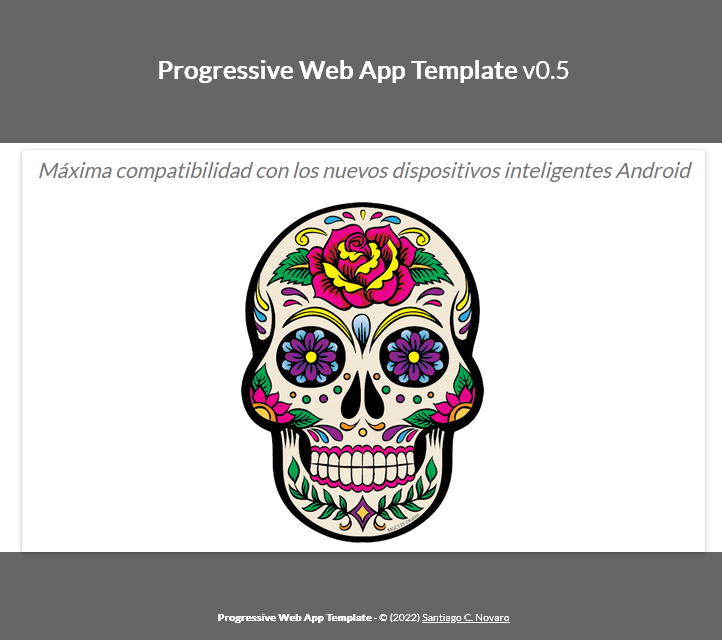

# Plantilla vacía para crear una Web App
**Versión 0.6** - *2022-08-12*

## Descripción general

Este template *Progressive Web App* (**PWA**)

- Implementa un **manifest.json** (`manifest.php`) y un **serviceWorker.js** (`sw.php`) listo para registrar una **PWA** en `Chrome` y otros navegadores.
- Implementa el chequeo inicial del servicio de **localStorage** y lo deja listo para usar.
- Define estilos básicos responsivos (ver más abajo) en *HTML5* y *CSS3* sin complicar las cosas.
- Utiliza **W3.css** como ejemplo simple de implementación de una *framework* pero el template es independiente de esta o cualquier *framework* **CSS** o **JavaScript**
- Define una larga lista de **cabeceras** y *meta-tags* necesarias no sólo para el protocolo **PWA** sino también para poder **compartir** correctamente la app en las *redes sociales* más importantes dejando la *app* lista para usar.

## Demo

Se puede ver esta plantilla [en acción](http://lengua.la/mvm/apps/app).

## Estilos y CSS

El presente template viene con varias imágenes de ejemplo que tienen las dimensiones adecuadas para mostrarse adecuadamente en los distintos dispositivos.
Los archivos de imagen en distintas dimensiones requeridos para este template están en la carpeta **[img/](img/)**.

### w3.css & font-awesome.min.css

El template usa por defecto una plantilla CSS muy simple pero útil creada por [W3Schools](https://www.w3schools.com/w3css/defaulT.asp) que permite dar formatos y estilos estándar a la app. 
Esta plantilla (no llega a ser una framework) utiliza una versión abierta de *FontAwesome* para darnos muchos íconos que podemos usar [como dice acá](https://www.w3schools.com/w3css/w3css_icons.asp).
Las fonts de estos íconos están en la carpeta **[fonts/](fonts/)**.

### style.css

Los estilos de la app se pueden poner en este archivo.

## Descripción de los archivos PHP que conforman este template:

### appConfig.php

Este archivo contiene los metadatos técnicamente indispensables para una Progressive Web App

    $app_name = "Progressive Web App Template Vacío";    // El nombre de la App
    $app_shortname = "app";                   // Nombre corto de la app
    $app_author = "Santiago C. Novaro";            // Autor de la app
    $app_authorTwitter = "@sanxofon";              // Usuario twitter del autor de la app 
    $app_subject = "Matemáticas";  // Temas de la app (separados por coma) 
    $app_version = "v0.6";                         // Versión actual
    $app_year = "2022";                            // Año de publicación de la app
    if(@$_GET['launcher']) $app_version = $app_version."b"; // No modificar esta línea
    $app_description = "Compatibilidad con los nuevos dispositivos inteligentes"; // Descripción general de la app.
    $app_server = "";                   // Servidor donde la app está alojada (DNS ó IP). Se puede usar cadena vacía "" para cualquiera.
    $app_path = "/mvm/apps/".$app_shortname."/";  // Ruta absoluta a la app desde la raíz del servidor (debe empezar y terminar en "/")

### appHeader.php

Cabecera de la app. No necesita demasiadas modificaciones excepto que acá se deben incluír las librerías javascript y recursos css que se requieran en la app.

### appFooter.php

Footer general de la app. Puede incluir disclaimers legales, copyright, enlaces, contacto, redes, etc.

### index.php & appStart.php

Son ejemplos simples de páginas que implementan el template actual.

### manifest.php

Se trata de un archivo indispensable para el protocolo de PWA. El template se encarga de generar este archivo correctamente.

### sw.php

Este es el *service worker* de la app. Toda web app que se precie necesitará eventualmente un *service worker*. Esto permite, entre otras cosas navegar ráidamente usando caché, acceso offline, notificaciones push y más.
